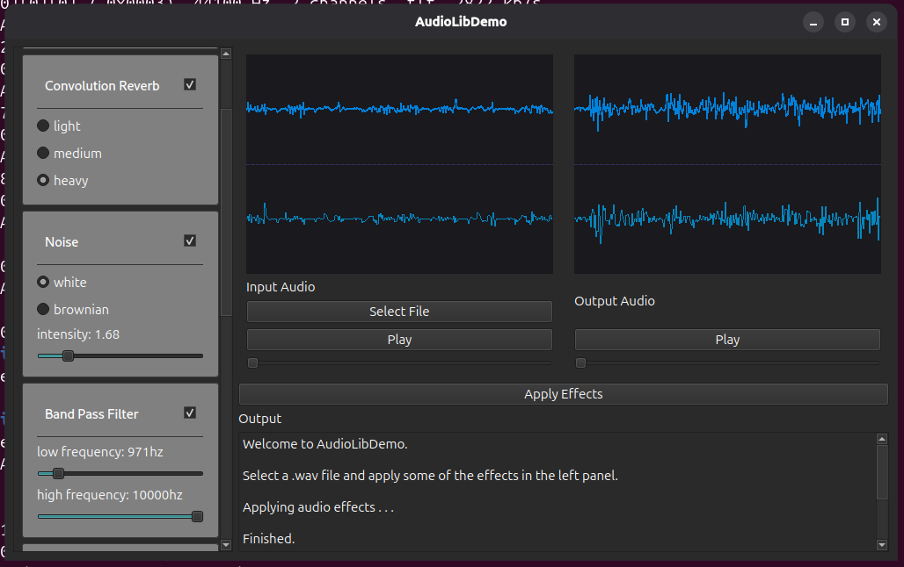

<h2>AudioProcessing</h2>

This project consists of a simple library (`AudioLib`) for processing .wav files and a demo (`AudioLibDemo`) showcasing the included audio processing effects. 

Featured effects:
* Gain - multiplies the volume by a constant gain factor.
* Convolution reverb - emulates a reverberation effect by taking the convolution of the input with an impulse reponse sample.
* Noise - adds noise to the audio signal.
* Band pass filter - eliminates frequencies outside of a specified range.
* Pan - rotates the direction of the audio.
* Resample - changes sample rate.
* Compressor - limits volume. Has an "attack" parameter which determines how quickly the volume reduction engages.
* Mono to stereo/stereo to mono - convert between stereo and mono signals. 

<h2>Build Process</h2>

Qt and CMake must be installed to build this project.

<h3>Linux+make</h3>

```
git clone https://github.com/ColinN05/AudioProcessing --recurse-submodules
mkdir build
cd build
cmake .. -DCMAKE_BUILD_TYPE=Release
make
AudioLibDemo/AudioLibDemo
```

<h3>Windows+msvc</h3>

```
git clone https://github.com/ColinN05/AudioProcessing --recurse-submodules
mkdir build
cd build
cmake .. -G "Visual Studio 17 2022" -DCMAKE_PREFIX_PATH=<qt-cmake-dir>
set PATH=<qt-dll-dir>;%PATH%
cmake --build . --config Release
```

* `qt-cmake-dir`: where your Qt CMake configuration files are installed. 
* `qt-dll-dir`: where your Qt DLLs are installed. 

